# Nusabin Srikandi ADV — Architecture Diagrams (Mermaid)

Dokumen ini berisi script Mermaid siap pakai untuk dokumentasi bertingkat:
- **L0**: System Context
- **L1**: Container / Runtime Blocks
- **L2**: Component Internal (Backend)
- **L3**: Runtime Flows (Detection, Event, Serial, Feedback)
- **Ops**: Deployment, Health, Failure Recovery

> Catatan: diagram disusun berdasarkan implementasi aktual di `run.py`, `app/__init__.py`, `app/detection_service.py`, `app/routes/main.py`, `utils/realtime_storage.py`, `models/detector.py`, `app/static/js/*.js`.

---

## 1) L0 — System Context

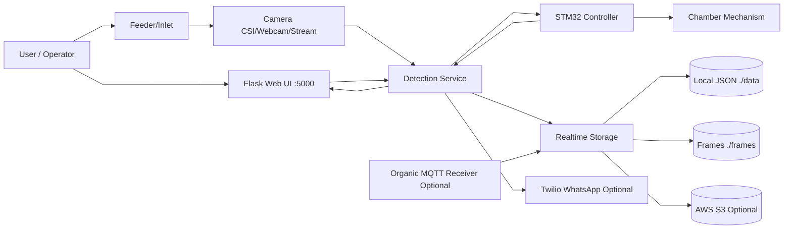

---

## 2) L1 — Container View

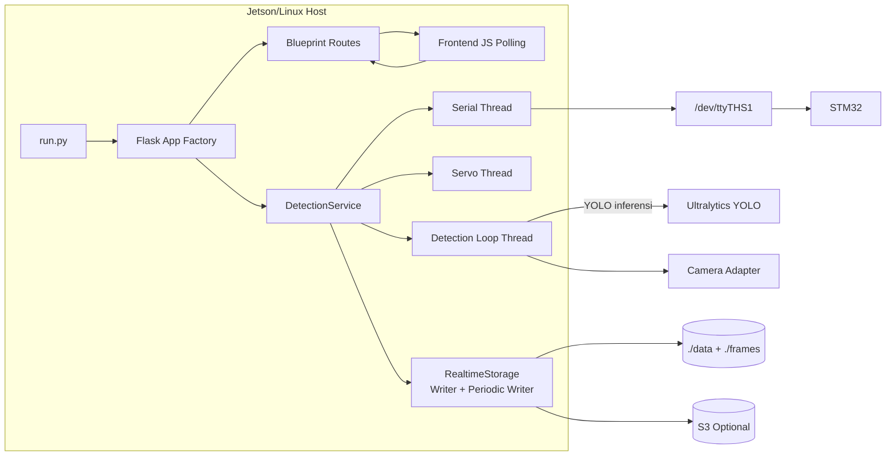

---

## 3) L2 — Backend Component Diagram

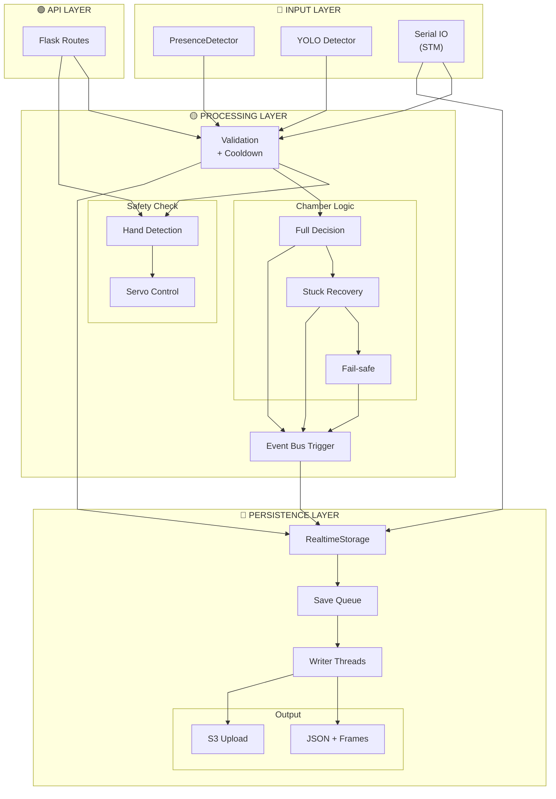

---

## 4) L3 — Main Detection Runtime Flow

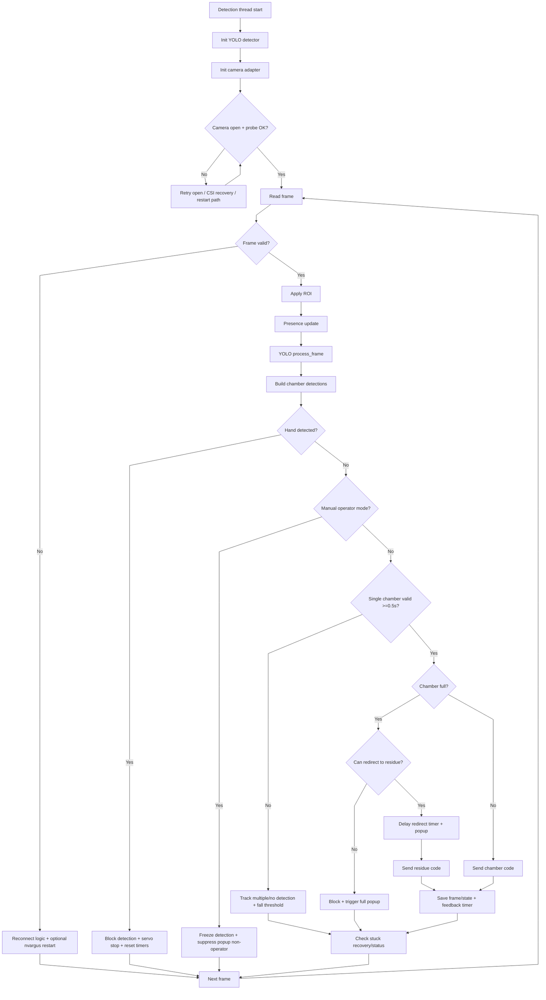

---

## 5) Serial Communication Flow (STM)

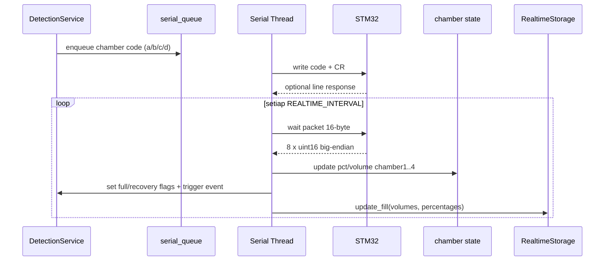

### Mapping packet STM → chamber internal

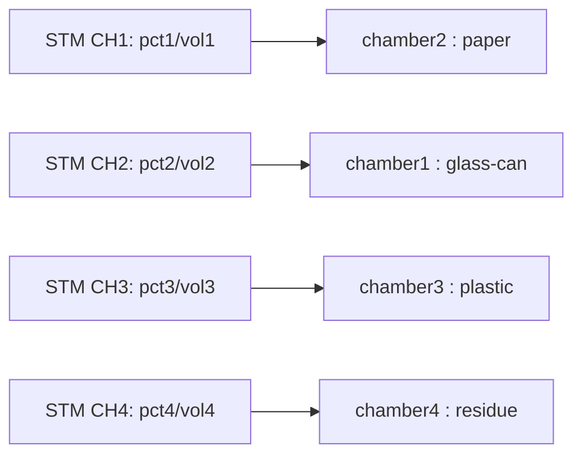

---

## 6) Event & Popup Flow (Backend ↔ Frontend)

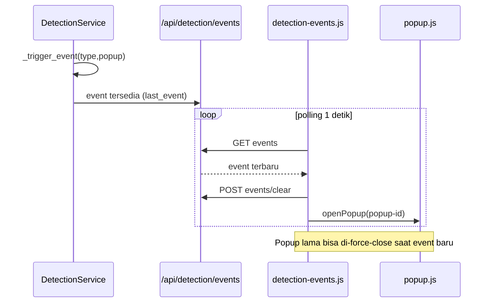

---

## 7) Feedback Confirmation Flow

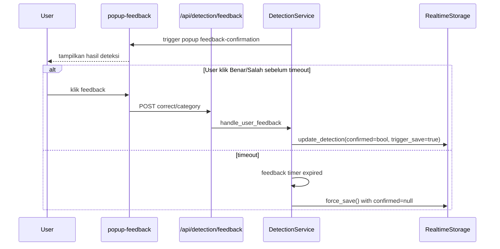

---

## 8) Force Dump Flow

```mermaid
flowchart TD
    A[User klik Buang Paksa] --> B[POST /api/detection/force-dump]
    B --> C[validate category]
    C --> D{serial available?}
    D -- No --> E[return failed]
    D -- Yes --> F{target chamber full?}
    F -- Yes --> G[block + popup full]
    F -- No --> H[map chamber->code]
    H --> I[_send_data(force=true)]
    I --> J[update cooldown + tracking]
    J --> K[save force frame + force dump event]
    K --> L[return success]
```

---

## 9) Safety State Machine (Hand + Servo + Manual Mode)

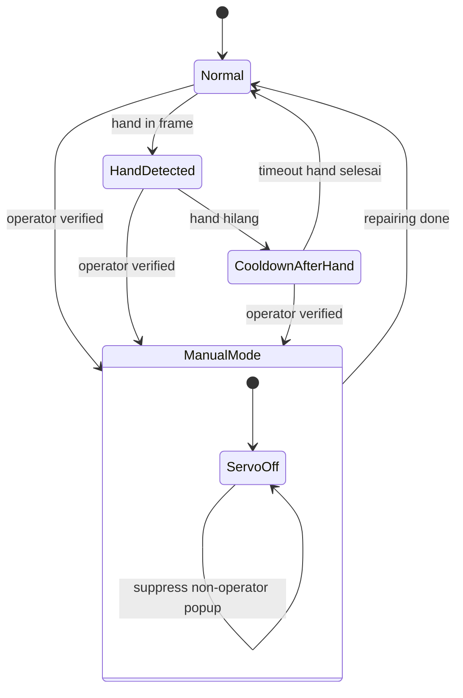

---

## 10) Chamber Full / Redirect Decision Flow

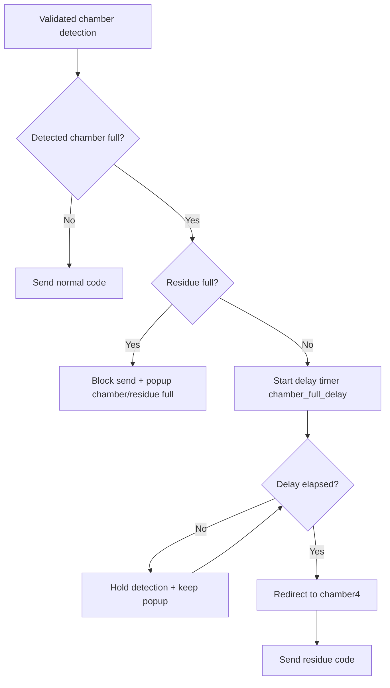

---

## 11) Waste Stuck Detection & Recovery

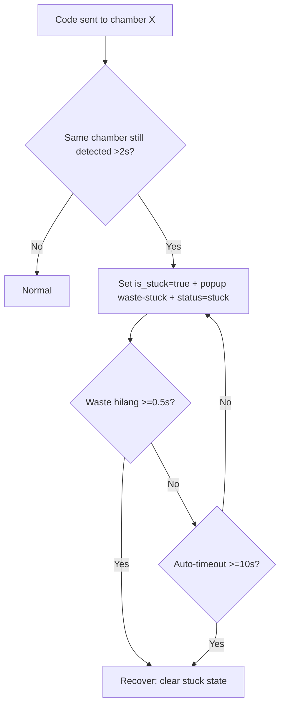

---

## 12) Presence Episode & Fail-safe

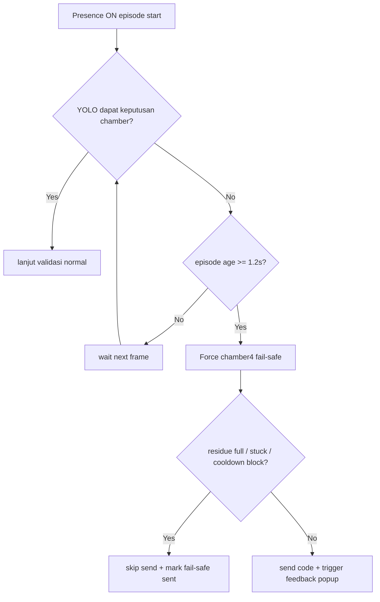

---

## 13) Data Persistence Flow (Event + Periodic)

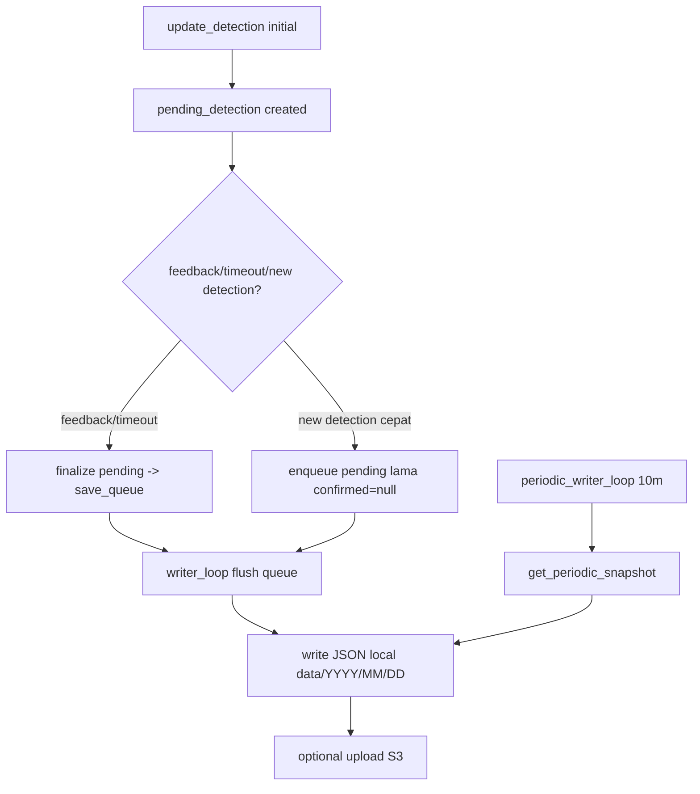

---

## 14) Deployment / Process Diagram

```mermaid
flowchart TB
    subgraph Systemd
      SVC[srikandi.service]
      UCF[upload-clean-frames.service]
      UCT[upload-clean-frames.timer]
    end

    SVC --> APP[python run.py]
    APP --> FLASK[Flask + Detection Threads]

    FLASK --> UART[/dev/ttyTHS1]
    FLASK --> CAM[CSI Camera /dev/video*]
    FLASK --> FS[(data + frames)]
    FLASK --> NET[MQTT / S3 / Twilio]

    UCT --> UCF
    UCF --> FS
    UCF --> S3[(S3 clean frames)]
```

---

## 15) API Surface Map (High-Level)

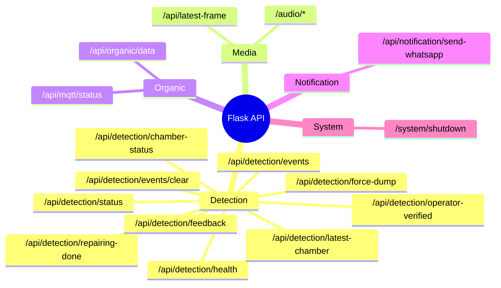

---

## 16) Frontend Runtime Flow

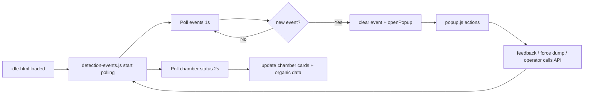

---

## 17) Diagram Referensi C4-Style (Opsional untuk Presentasi)

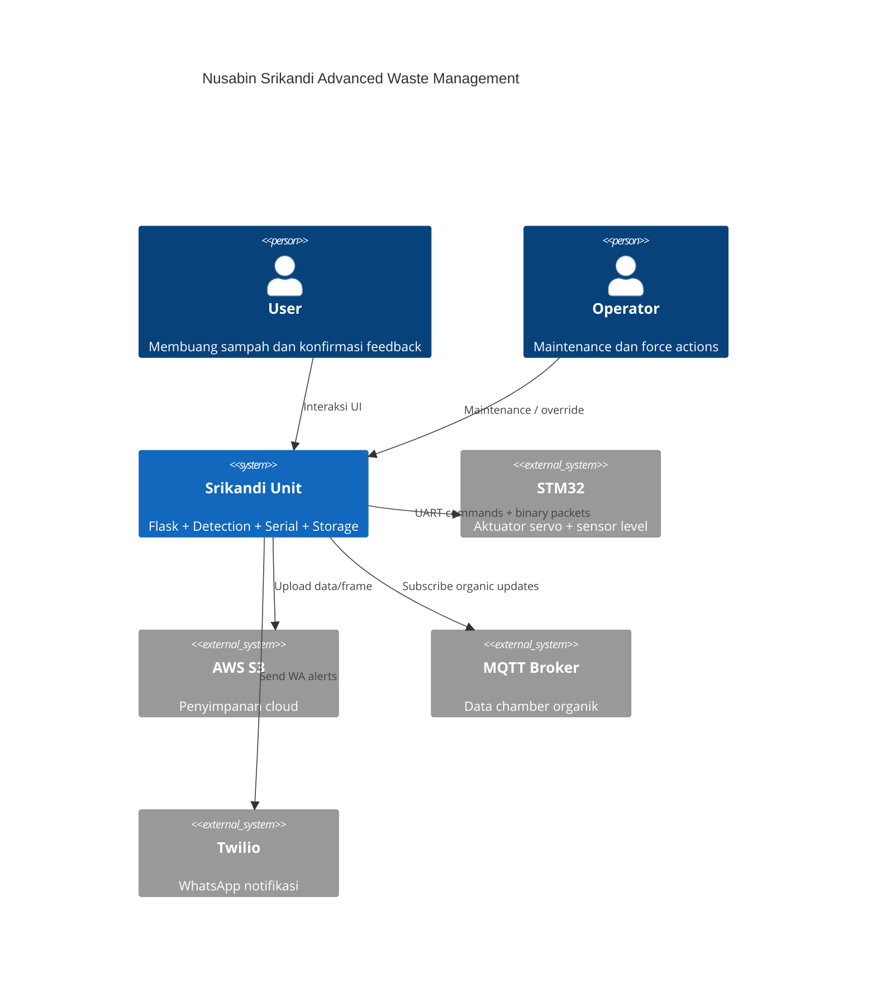

> Jika renderer Mermaid Anda belum support `C4Context`, gunakan diagram L0/L1 sebagai pengganti.

---

## 18) Legend Status & Threshold

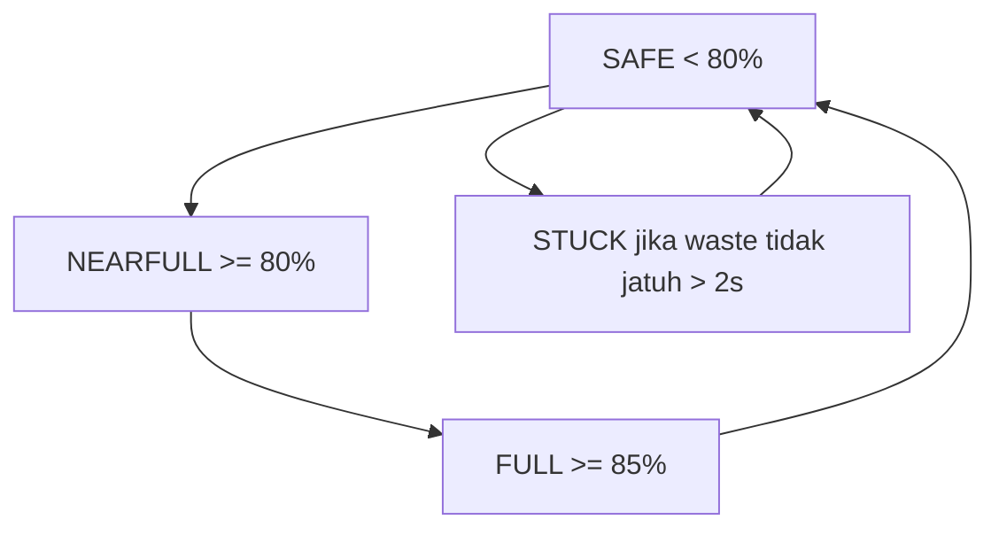

---

## Cara Pakai

1. Simpan file ini di dokumentasi project.
2. Render dengan Mermaid viewer (GitHub, VSCode Mermaid extension, MkDocs, Docusaurus).
3. Ambil diagram per bagian sesuai kebutuhan (ops, dev, onboarding, audit).

Selesai. Jika dibutuhkan, diagram ini bisa saya pecah lagi per file (`docs/diagrams/*.md`) untuk maintainability tim.
